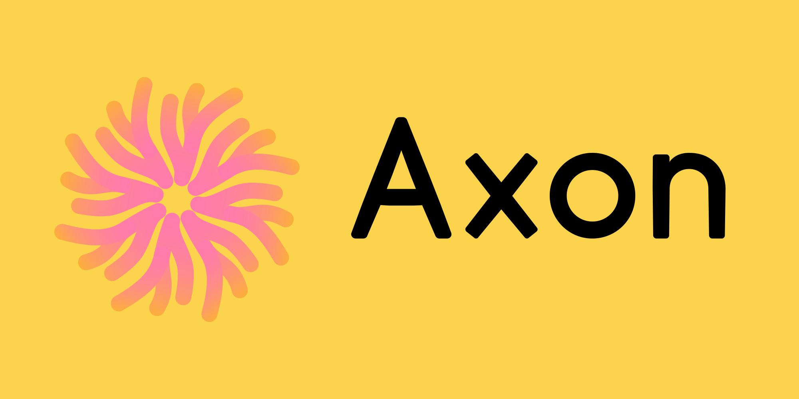

<p align="center">
  
</p>
<p align="center">
<i>The function of the axon is to transmit information to different neurons - <a href="https://en.wikipedia.org/wiki/Axon">Wikipedia</a></i></p>

---

Axon is a multi-user, multi-neuron management canister.

## Overview

- An Axon canister controls one or more neurons
- Axons can have one or more owners
- An approval policy can be set, eg. 3 out of 5 owners required to approve an action
- Requests like `ManageNeuron` are sent to Axon, which queues them for approval
- A snapshot of owners and current policy is stored with each request
- Once the policy conditions are met, the request is forwarded to all controlled neurons
- Axons can be public and expose all neuron data

## Usage

Deploy an Axon canister:

```sh
dfx deploy Axon --argument 'record {owner= (principal "your-principal-here"); visibility= variant{Public}}'
```

Currently, canisters cannot control neurons or hold ICP. It is only possible to add the Axon canister as a hot key for neurons, so only commands like `Follow` and `RegisterVote` will succeed.
